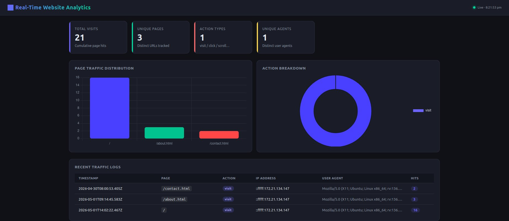
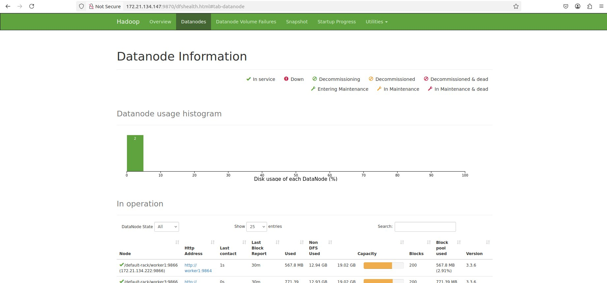
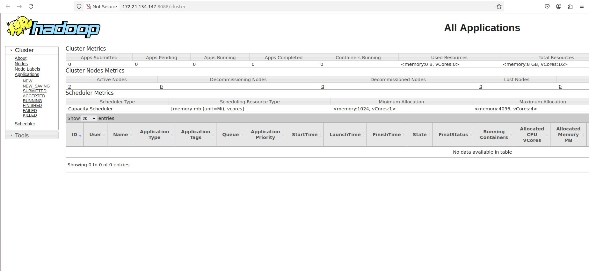
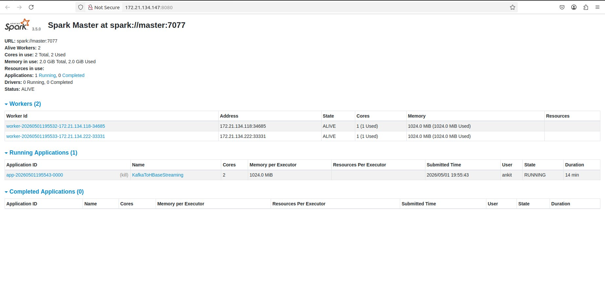
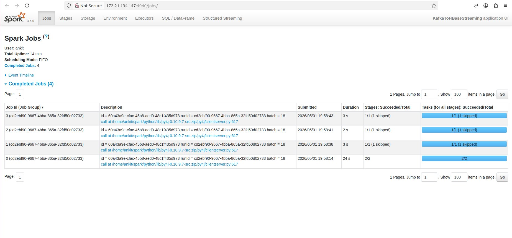
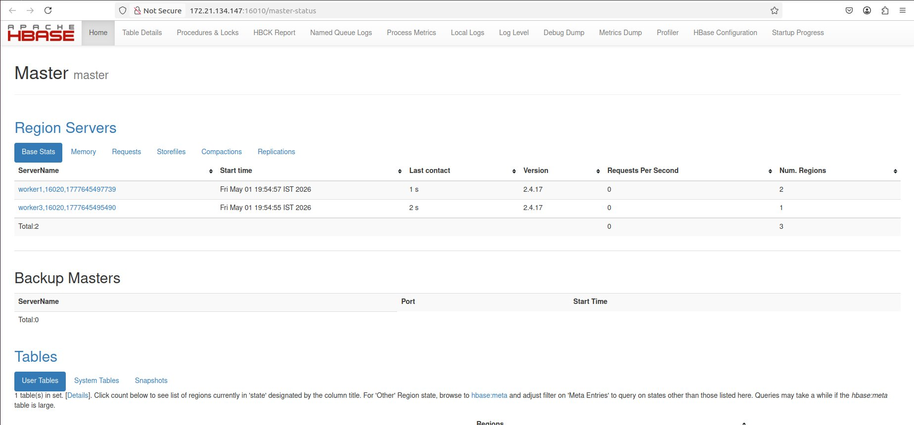
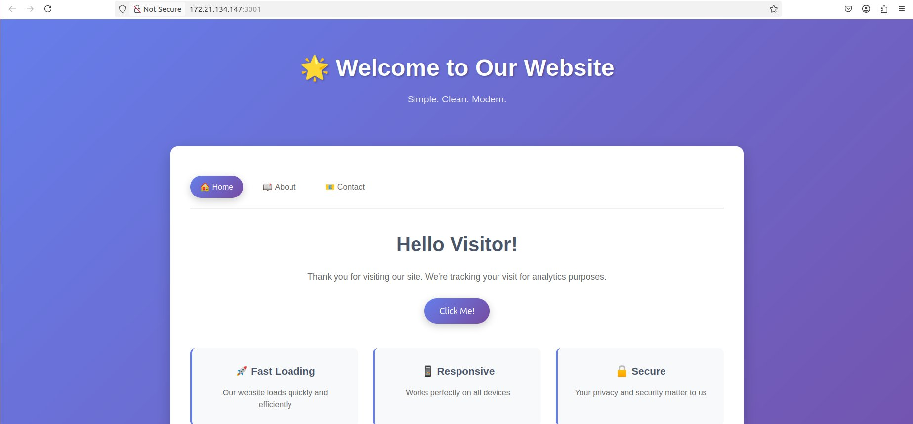

# 🌐 Real-Time Website Traffic Monitoring System

A end-to-end big data pipeline that captures, streams, processes, and visualises website visitor events in real time — built entirely on open-source distributed technologies.

[](https://hadoop.apache.org/)
[](https://kafka.apache.org/)
[](https://spark.apache.org/)
[](https://hbase.apache.org/)
[](https://flask.palletsprojects.com/)
[](https://nodejs.org/)

---

## 📌 Table of Contents

- [Overview](#-overview)
- [Architecture](#-architecture)
- [Tech Stack](#-tech-stack)
- [Project Structure](#-project-structure)
- [Prerequisites](#-prerequisites)
- [Setup & Configuration](#-setup--configuration)
- [Quick Start](#-quick-start)
- [Service URLs](#-service-urls)
- [Scripts Reference](#-scripts-reference)
- [Screenshots](#-screenshots)
- [How It Works](#-how-it-works)

---

## 🔍 Overview

This project implements a **real-time clickstream analytics pipeline** for a multi-page website. Every page visit is captured, published to a Kafka topic, processed by a Spark Structured Streaming job, persisted to HBase, and finally rendered on a live-updating analytics dashboard.

**Key capabilities:**
- Sub-minute latency from browser visit → dashboard metric update
- Stateful session tracking (active users, unique visitors)
- Page-level traffic distribution with action breakdown
- Horizontally scalable — add HDFS datanodes or Spark workers without code changes

---

## 🏗️∩╕Å Architecture

```
ΓöîΓöÇΓöÇΓöÇΓöÇΓöÇΓöÇΓöÇΓöÇΓöÇΓöÇΓöÇΓöÇΓöÇΓöÇΓöÇΓöÇΓöÇΓöÇΓöÇΓöÇΓöÇΓöÇΓöÇΓöÇΓöÇΓöÇΓöÇΓöÇΓöÇΓöÇΓöÇΓöÇΓöÇΓöÇΓöÇΓöÇΓöÇΓöÇΓöÇΓöÇΓöÇΓöÇΓöÇΓöÇΓöÇΓöÇΓöÇΓöÇΓöÇΓöÇΓöÇΓöÇΓöÇΓöÇΓöÇΓöÇΓöÇΓöÇΓöÇΓöÇΓöÇΓöÇΓöÇΓöÇΓöÇΓöÇΓöÇΓöÇΓöÇΓöÇΓöÉ
Γöé                          USER'S BROWSER                              Γöé
ΓööΓöÇΓöÇΓöÇΓöÇΓöÇΓöÇΓöÇΓöÇΓöÇΓöÇΓöÇΓöÇΓöÇΓöÇΓöÇΓöÇΓöÇΓöÇΓöÇΓöÇΓöÇΓöÇΓöÇΓöÇΓöÇΓöÇΓöÇΓöÇΓöÇΓöÇΓöÇΓö¼ΓöÇΓöÇΓöÇΓöÇΓöÇΓöÇΓöÇΓöÇΓöÇΓöÇΓöÇΓöÇΓöÇΓöÇΓöÇΓöÇΓöÇΓöÇΓöÇΓöÇΓöÇΓöÇΓöÇΓöÇΓöÇΓöÇΓöÇΓöÇΓöÇΓöÇΓöÇΓöÇΓöÇΓöÇΓöÇΓöÇΓöÇΓöÇΓöÿ
                                Γöé  HTTP visit
                                Γû╝
ΓöîΓöÇΓöÇΓöÇΓöÇΓöÇΓöÇΓöÇΓöÇΓöÇΓöÇΓöÇΓöÇΓöÇΓöÇΓöÇΓöÇΓöÇΓöÇΓöÇΓöÇΓöÇΓöÇΓöÇΓöÇΓöÇΓöÇΓöÇΓöÇΓöÇΓöÇΓöÇΓöÇΓöÇΓöÇΓöÇΓöÇΓöÇΓöÇΓöÇΓöÇΓöÇΓöÇΓöÇΓöÇΓöÇΓöÇΓöÇΓöÇΓöÇΓöÇΓöÇΓöÇΓöÇΓöÇΓöÇΓöÇΓöÇΓöÇΓöÇΓöÇΓöÇΓöÇΓöÇΓöÇΓöÇΓöÇΓöÇΓöÇΓöÇΓöÇΓöÉ
Γöé               Node.js / Express  (port 3001)                         Γöé
Γöé   ΓÇó Serves static HTML pages (/, /about, /contact)                   Γöé
Γöé   ΓÇó Tracking middleware — captures IP, User-Agent, page, timestamp   Γöé
Γöé   ΓÇó In-memory session store with 15 s timeout                        Γöé
│   • KafkaJS producer → publishes JSON events to `website_logs`       │
ΓööΓöÇΓöÇΓöÇΓöÇΓöÇΓöÇΓöÇΓöÇΓöÇΓöÇΓöÇΓöÇΓöÇΓöÇΓöÇΓöÇΓöÇΓöÇΓöÇΓöÇΓöÇΓöÇΓöÇΓöÇΓöÇΓöÇΓöÇΓöÇΓöÇΓöÇΓöÇΓö¼ΓöÇΓöÇΓöÇΓöÇΓöÇΓöÇΓöÇΓöÇΓöÇΓöÇΓöÇΓöÇΓöÇΓöÇΓöÇΓöÇΓöÇΓöÇΓöÇΓöÇΓöÇΓöÇΓöÇΓöÇΓöÇΓöÇΓöÇΓöÇΓöÇΓöÇΓöÇΓöÇΓöÇΓöÇΓöÇΓöÇΓöÇΓöÇΓöÿ
                                Γöé  Kafka message
                                Γû╝
ΓöîΓöÇΓöÇΓöÇΓöÇΓöÇΓöÇΓöÇΓöÇΓöÇΓöÇΓöÇΓöÇΓöÇΓöÇΓöÇΓöÇΓöÇΓöÇΓöÇΓöÇΓöÇΓöÇΓöÇΓöÇΓöÇΓöÇΓöÇΓöÇΓöÇΓöÇΓöÇΓöÇΓöÇΓöÇΓöÇΓöÇΓöÇΓöÇΓöÇΓöÇΓöÇΓöÇΓöÇΓöÇΓöÇΓöÇΓöÇΓöÇΓöÇΓöÇΓöÇΓöÇΓöÇΓöÇΓöÇΓöÇΓöÇΓöÇΓöÇΓöÇΓöÇΓöÇΓöÇΓöÇΓöÇΓöÇΓöÇΓöÇΓöÇΓöÇΓöÉ
Γöé              Apache Kafka  (broker: master:9092)                     Γöé
Γöé   ΓÇó Topic: website_logs                                              Γöé
Γöé   ΓÇó Durable, ordered log of all traffic events                       Γöé
ΓööΓöÇΓöÇΓöÇΓöÇΓöÇΓöÇΓöÇΓöÇΓöÇΓöÇΓöÇΓöÇΓöÇΓöÇΓöÇΓöÇΓöÇΓöÇΓöÇΓöÇΓöÇΓöÇΓöÇΓöÇΓöÇΓöÇΓöÇΓöÇΓöÇΓöÇΓöÇΓö¼ΓöÇΓöÇΓöÇΓöÇΓöÇΓöÇΓöÇΓöÇΓöÇΓöÇΓöÇΓöÇΓöÇΓöÇΓöÇΓöÇΓöÇΓöÇΓöÇΓöÇΓöÇΓöÇΓöÇΓöÇΓöÇΓöÇΓöÇΓöÇΓöÇΓöÇΓöÇΓöÇΓöÇΓöÇΓöÇΓöÇΓöÇΓöÇΓöÿ
                                Γöé  readStream
                                Γû╝
ΓöîΓöÇΓöÇΓöÇΓöÇΓöÇΓöÇΓöÇΓöÇΓöÇΓöÇΓöÇΓöÇΓöÇΓöÇΓöÇΓöÇΓöÇΓöÇΓöÇΓöÇΓöÇΓöÇΓöÇΓöÇΓöÇΓöÇΓöÇΓöÇΓöÇΓöÇΓöÇΓöÇΓöÇΓöÇΓöÇΓöÇΓöÇΓöÇΓöÇΓöÇΓöÇΓöÇΓöÇΓöÇΓöÇΓöÇΓöÇΓöÇΓöÇΓöÇΓöÇΓöÇΓöÇΓöÇΓöÇΓöÇΓöÇΓöÇΓöÇΓöÇΓöÇΓöÇΓöÇΓöÇΓöÇΓöÇΓöÇΓöÇΓöÇΓöÇΓöÉ
Γöé       Apache Spark Structured Streaming  (spark://master:7077)       Γöé
Γöé   ΓÇó Parses JSON events (ip, user_agent, page, action, timestamp)     Γöé
Γöé   ΓÇó Groups by page — counts hits, retains latest metadata            Γöé
Γöé   ΓÇó 15-second micro-batch trigger                                    Γöé
Γöé   ΓÇó foreachBatch writes to HBase via Happybase (Thrift API)          Γöé
Γöé   ΓÇó POSTs aggregated batch to Flask /update endpoint                 Γöé
Γöé   ΓÇó Checkpoints on HDFS: hdfs://master:9000/user/ankit/spark-...    Γöé
ΓööΓöÇΓöÇΓöÇΓöÇΓöÇΓöÇΓöÇΓöÇΓöÇΓöÇΓöÇΓöÇΓöÇΓöÇΓöÇΓöÇΓöÇΓöÇΓöÇΓöÇΓöÇΓöÇΓöÇΓöÇΓöÇΓöÇΓöÇΓöÇΓöÇΓöÇΓöÇΓö¼ΓöÇΓöÇΓöÇΓöÇΓöÇΓöÇΓöÇΓöÇΓöÇΓöÇΓöÇΓöÇΓöÇΓöÇΓöÇΓöÇΓöÇΓöÇΓöÇΓöÇΓöÇΓöÇΓöÇΓöÇΓöÇΓöÇΓöÇΓöÇΓöÇΓöÇΓöÇΓöÇΓöÇΓöÇΓöÇΓöÇΓöÇΓöÇΓöÿ
                                Γöé  Thrift write
                                Γû╝
ΓöîΓöÇΓöÇΓöÇΓöÇΓöÇΓöÇΓöÇΓöÇΓöÇΓöÇΓöÇΓöÇΓöÇΓöÇΓöÇΓöÇΓöÇΓöÇΓöÇΓöÇΓöÇΓöÇΓöÇΓöÇΓöÇΓöÇΓöÇΓöÇΓöÇΓöÇΓöÇΓöÇΓöÇΓöÇΓöÇΓöÇΓöÇΓöÇΓöÇΓöÇΓöÇΓöÇΓöÇΓöÇΓöÇΓöÇΓöÇΓöÇΓöÇΓöÇΓöÇΓöÇΓöÇΓöÇΓöÇΓöÇΓöÇΓöÇΓöÇΓöÇΓöÇΓöÇΓöÇΓöÇΓöÇΓöÇΓöÇΓöÇΓöÇΓöÇΓöÉ
Γöé             Apache HBase  (master:16010 / Thrift: 9090)              Γöé
Γöé   ΓÇó Table: web_traffic                                               Γöé
Γöé   ΓÇó Row key: page URL                                                Γöé
Γöé   ΓÇó Column family cf: { timestamp, page, user_agent,                 Γöé
Γöé                         count, ip, action }                          Γöé
ΓööΓöÇΓöÇΓöÇΓöÇΓöÇΓöÇΓöÇΓöÇΓöÇΓöÇΓöÇΓöÇΓöÇΓöÇΓöÇΓöÇΓöÇΓöÇΓöÇΓöÇΓöÇΓöÇΓöÇΓöÇΓöÇΓöÇΓöÇΓöÇΓöÇΓöÇΓöÇΓö¼ΓöÇΓöÇΓöÇΓöÇΓöÇΓöÇΓöÇΓöÇΓöÇΓöÇΓöÇΓöÇΓöÇΓöÇΓöÇΓöÇΓöÇΓöÇΓöÇΓöÇΓöÇΓöÇΓöÇΓöÇΓöÇΓöÇΓöÇΓöÇΓöÇΓöÇΓöÇΓöÇΓöÇΓöÇΓöÇΓöÇΓöÇΓöÇΓöÿ
                                Γöé  HBase scan
                                Γû╝
ΓöîΓöÇΓöÇΓöÇΓöÇΓöÇΓöÇΓöÇΓöÇΓöÇΓöÇΓöÇΓöÇΓöÇΓöÇΓöÇΓöÇΓöÇΓöÇΓöÇΓöÇΓöÇΓöÇΓöÇΓöÇΓöÇΓöÇΓöÇΓöÇΓöÇΓöÇΓöÇΓöÇΓöÇΓöÇΓöÇΓöÇΓöÇΓöÇΓöÇΓöÇΓöÇΓöÇΓöÇΓöÇΓöÇΓöÇΓöÇΓöÇΓöÇΓöÇΓöÇΓöÇΓöÇΓöÇΓöÇΓöÇΓöÇΓöÇΓöÇΓöÇΓöÇΓöÇΓöÇΓöÇΓöÇΓöÇΓöÇΓöÇΓöÇΓöÇΓöÉ
Γöé              Flask Dashboard  (port 5000)                            Γöé
Γöé   ΓÇó GET /stats  — reads HBase, returns JSON metrics                  Γöé
Γöé   ΓÇó POST /update — receives push from Spark batch                    Γöé
Γöé   ΓÇó Renders dark-theme analytics UI (Chart.js)                       Γöé
Γöé     ┬╖ KPI cards: total visits, unique pages, action types, agents    Γöé
Γöé     ┬╖ Bar chart: page traffic distribution                           Γöé
Γöé     ┬╖ Doughnut: action breakdown                                     Γöé
Γöé     ┬╖ Live log table: last 20 events, auto-refresh every 3 s        Γöé
ΓööΓöÇΓöÇΓöÇΓöÇΓöÇΓöÇΓöÇΓöÇΓöÇΓöÇΓöÇΓöÇΓöÇΓöÇΓöÇΓöÇΓöÇΓöÇΓöÇΓöÇΓöÇΓöÇΓöÇΓöÇΓöÇΓöÇΓöÇΓöÇΓöÇΓöÇΓöÇΓöÇΓöÇΓöÇΓöÇΓöÇΓöÇΓöÇΓöÇΓöÇΓöÇΓöÇΓöÇΓöÇΓöÇΓöÇΓöÇΓöÇΓöÇΓöÇΓöÇΓöÇΓöÇΓöÇΓöÇΓöÇΓöÇΓöÇΓöÇΓöÇΓöÇΓöÇΓöÇΓöÇΓöÇΓöÇΓöÇΓöÇΓöÇΓöÇΓöÿ

Underlying storage layer — Apache Hadoop HDFS (3 nodes, replication 2)
Resource management   — Apache YARN (2 active nodes, 8 GB / 16 vCores)
```

---

## 🛠️ Tech Stack

| Layer | Technology | Version | Role |
|---|---|---|---|
| **Ingestion** | Node.js + Express + KafkaJS | LTS | Web server & Kafka producer |
| **Message Queue** | Apache Kafka + ZooKeeper | 3.x | Durable event stream |
| **Stream Processing** | Apache Spark Structured Streaming | 3.5.0 | Micro-batch aggregation |
| **Storage** | Apache HBase | 2.4.17 | Low-latency NoSQL store |
| **Distributed FS** | Apache Hadoop HDFS | 3.3.6 | Spark checkpoints & block storage |
| **Resource Manager** | Apache YARN | 3.3.6 | Cluster resource scheduling |
| **Dashboard API** | Flask + Flask-CORS | 3.0 | REST API & server-side rendering |
| **HBase Client** | Happybase | 1.3.0 | Python → HBase Thrift bridge |
| **Python Kafka** | kafka-python | 2.3.0 | Python producer (backend.py) |

---

## 📂 Project Structure

```
bigdata-project/
Γöé
Γö£ΓöÇΓöÇ spark/
Γöé   ΓööΓöÇΓöÇ kafka_to_hbase_stream.py     # Spark Structured Streaming job
Γöé
Γö£ΓöÇΓöÇ dashboard/
Γöé   Γö£ΓöÇΓöÇ dashboard_server.py          # Flask API (/stats, /update, /)
Γöé   ΓööΓöÇΓöÇ templates/
Γöé       ΓööΓöÇΓöÇ dashboard.html           # Dark-theme Chart.js analytics UI
Γöé
Γö£ΓöÇΓöÇ website-traffic-monitoring-system/
Γöé   Γö£ΓöÇΓöÇ server.js                    # Express server + KafkaJS producer
Γöé   ΓööΓöÇΓöÇ public/
Γöé       Γö£ΓöÇΓöÇ index.html               # Home page (tracked)
Γöé       Γö£ΓöÇΓöÇ about.html               # About page (tracked)
Γöé       Γö£ΓöÇΓöÇ contact.html             # Contact page (tracked)
Γöé       Γö£ΓöÇΓöÇ script.js                # Client-side interactions
Γöé       ΓööΓöÇΓöÇ style.css                # Site styling
Γöé
Γö£ΓöÇΓöÇ backend/
Γöé   ΓööΓöÇΓöÇ backend.py                   # Flask REST API + Kafka producer (alt backend)
Γöé
Γö£ΓöÇΓöÇ config/
Γöé   Γö£ΓöÇΓöÇ kafka_topic.sh               # Create `website_logs` Kafka topic
Γöé   ΓööΓöÇΓöÇ create_hbase_table.sh        # Create `web_traffic` HBase table
Γöé
Γö£ΓöÇΓöÇ configs/                         # XML config templates
Γöé   Γö£ΓöÇΓöÇ core-site.xml.template
Γöé   Γö£ΓöÇΓöÇ hdfs-site.xml.template
Γöé   ΓööΓöÇΓöÇ hbase-site.xml.template
Γöé
Γö£ΓöÇΓöÇ configs_xml/                     # Active XML configs
Γöé   Γö£ΓöÇΓöÇ core-site.xml
Γöé   Γö£ΓöÇΓöÇ hdfs-site.xml
Γöé   ΓööΓöÇΓöÇ hbase-site.xml
Γöé
Γö£ΓöÇΓöÇ run_project.sh                   # 🚀 One-shot: start all services
├── stop_cluster.sh                  # 🛑 Graceful shutdown
├── reset_cluster.sh                 # 🔄 Full reset (data + logs + checkpoints)
├── reset_values.sh                  # 🗑️  Clear live data only (HBase + checkpoints)
Γö£ΓöÇΓöÇ health_check.sh                  # 🔍 Verify all services are running
Γö£ΓöÇΓöÇ ports.sh                         # 🌐 Print all service URLs
Γö£ΓöÇΓöÇ kafka.sh                         # Restart Kafka only
Γö£ΓöÇΓöÇ stream.sh                        # Start Spark streaming job only
Γö£ΓöÇΓöÇ start_streaming.sh               # Start streaming with env pre-check
Γö£ΓöÇΓöÇ start_cluster.sh                 # Start Hadoop + ZK + Kafka + HBase only
Γö£ΓöÇΓöÇ requirements.txt                 # Python dependencies
ΓööΓöÇΓöÇ logs/                            # Created at runtime
    Γö£ΓöÇΓöÇ spark.log
    Γö£ΓöÇΓöÇ dashboard.log
    ΓööΓöÇΓöÇ website.log
```

---

## ✅ Prerequisites

Make sure the following are **installed and configured** on your cluster before running the project:

| Software | Minimum Version | Notes |
|---|---|---|
| Apache Hadoop (HDFS + YARN) | 3.x | `start-dfs.sh` / `start-yarn.sh` on PATH |
| Apache ZooKeeper | bundled with Kafka | At `~/kafka-zk/` |
| Apache Kafka | 3.x | At `~/kafka-zk/` |
| Apache HBase | 2.x | `start-hbase.sh` / `hbase-daemon.sh` on PATH |
| Apache Spark | 3.5.0 | At `~/spark/`, `spark-submit` on PATH |
| Python | 3.8+ | `pip3` available |
| Node.js | 16+ | `node` + `npm` available |

**Install Python dependencies:**

```bash
pip3 install flask flask-cors happybase kafka-python requests
# or use the provided file (note: file includes all system packages)
pip3 install flask flask-cors happybase kafka-python requests
```

**Install Node dependencies (first-time only):**

```bash
cd website-traffic-monitoring-system
npm install
```

---

## ⚙️ Setup & Configuration

### 1. Hadoop configuration

Edit `configs_xml/core-site.xml` — set your NameNode address:

```xml
<configuration>
  <property>
    <name>fs.defaultFS</name>
    <value>hdfs://master:9000</value>
  </property>
</configuration>
```

Update `configs_xml/hdfs-site.xml` for replication factor and data directories as needed.

### 2. HBase configuration

Edit `configs_xml/hbase-site.xml` to point `hbase.rootdir` and `hbase.zookeeper.quorum` to your master node.

### 3. Kafka broker address

- **Node.js server** (`website-traffic-monitoring-system/server.js`, line 8): `brokers: ['master:9092']`
- **Spark job** (`spark/kafka_to_hbase_stream.py`, line 23): `"kafka.bootstrap.servers", "master:9092"`
- **Backend API** (`backend/backend.py`, line 14): update `bootstrap_servers` to your broker IP

### 4. HBase Thrift address

- **Spark job**: `happybase.Connection(host="master", port=9090)`
- **Dashboard server**: `happybase.Connection("master", port=9090)`

Replace `master` with your master node's hostname or IP in all files above.

---

## 🚀 Quick Start

```bash
# Clone the repository
git clone https://github.com/Slack-Hacker/bigdata-project
cd bigdata-project

# First-time only: create Kafka topic and HBase table
bash config/kafka_topic.sh
bash config/create_hbase_table.sh

# Start everything with a single command
bash run_project.sh
```

`run_project.sh` performs the following steps in order:

1. Start HDFS + YARN
2. Start ZooKeeper
3. Start Kafka
4. Start HBase
5. Start HBase Thrift server
6. Wait for HDFS safe mode to exit
7. Start Spark standalone cluster (master + workers)
8. Submit the Spark Streaming job
9. Start the Flask dashboard
10. Start the Node.js website

---

## 🌐 Service URLs

Once `run_project.sh` completes, all services are accessible at:

| Service | URL | Purpose |
|---|---|---|
| 🌐 Website | `http://master:3001` | Tracked web pages |
| 📊 Analytics Dashboard | `http://master:5000` | Real-time traffic visualisation |
| ΓÜí Spark Master UI | `http://master:8080` | Worker status, running apps |
| 📈 Spark App UI | `http://master:4040` | Job / stage / task detail |
| 🗄️ HDFS NameNode UI | `http://master:9870` | File system health & blocks |
| 🎛️ YARN ResourceManager | `http://master:8088` | Application & node metrics |
| 🏠 HBase Master UI | `http://master:16010` | Region servers & table info |

---

## 📜 Scripts Reference

| Script | Description |
|---|---|
| `run_project.sh` | **One-shot startup** — launches every service in the correct order |
| `stop_cluster.sh` | Gracefully stop all services (website → dashboard → Spark → HBase → Kafka → ZK → Hadoop) |
| `start_cluster.sh` | Start infrastructure only (Hadoop + ZK + Kafka + HBase), without Spark or the app |
| `start_streaming.sh` | Start the Spark streaming job only (services must already be running) |
| `stream.sh` | Minimal Spark submit wrapper |
| `kafka.sh` | Restart Kafka broker only |
| `reset_cluster.sh` | Full reset: stops everything, clears HBase data, logs, and HDFS checkpoints |
| `reset_values.sh` | Clear live data only (truncates HBase table + deletes checkpoints) while services stay up |
| `health_check.sh` | Print JVM processes, YARN nodes, Kafka topics, HBase tables, and port status |
| `ports.sh` | Print all service URLs in one place |

---

## 📸 Screenshots

### HDFS NameNode — Overview

> Hadoop 3.3.6 running on `master:9000`. HDFS reports 281 files/directories across 202 blocks, with 1.31 GB DFS used and 7.64 GB remaining.

---

### HDFS NameNode — Datanodes

> Two datanodes (`worker1` and `worker3`) are in service, each storing ~200 blocks with 19 GB capacity at ~3% disk utilisation.

---

### YARN ResourceManager — Cluster

> YARN shows 2 active nodes with 8 GB RAM and 16 vCores available. The Capacity Scheduler is configured for fair resource sharing.

---

### Spark Master UI

> Apache Spark 3.5.0 running with 2 alive workers, 2 cores and 2 GiB memory in use. The `KafkaToHBaseStreaming` application is live.

---

### Spark Jobs Dashboard

> The Spark UI shows 4 completed micro-batch jobs for the `KafkaToHBaseStreaming` application, each processing a 15-second batch window.

---

### HBase Master UI

> HBase 2.4.17 with 2 region servers (`worker1` and `worker3`) serving a total of 3 regions. The `web_traffic` user table is in set.

---

### Website — Tracked Pages

> The Node.js Express server serves the tracked multi-page website. Every visit is transparently captured and pushed to the Kafka `website_logs` topic.

---

### Real-Time Analytics Dashboard

> The Flask dashboard (dark theme) shows 21 total visits across 3 unique pages with live auto-refresh every 3 seconds. Includes page traffic bar chart, action breakdown doughnut, and a recent traffic log table.

---

## 🔬 How It Works

### Event Flow

1. **Visitor** loads any page on `http://master:3001`
2. **Express middleware** captures `ip`, `user_agent`, `page`, `action`, and `timestamp`; publishes a JSON message to the `website_logs` Kafka topic
3. **Spark Structured Streaming** continuously reads from the topic, deserialises JSON against a fixed schema, and aggregates visit counts grouped by page in 15-second micro-batches
4. **`write_to_hbase`** (foreachBatch callback) upserts aggregated rows into the `web_traffic` HBase table using Happybase over the Thrift API; then POSTs the batch payload to the Flask `/update` endpoint
5. **Flask dashboard** serves `/stats` by scanning the HBase table and returning page counts, action breakdown, unique agent counts, and the last 20 log entries; the browser polls every 3 seconds

### HBase Schema

```
Table:          web_traffic
Row key:        <page_url>            (e.g. "/", "/about.html")
Column family:  cf
  cf:page       page URL
  cf:count      cumulative hit count
  cf:timestamp  ISO-8601 timestamp of last event
  cf:ip         last visitor IP address
  cf:user_agent last visitor User-Agent string
  cf:action     last action type (visit / click / scroll)
```

### Spark Checkpoint

The streaming job persists its state to HDFS:

```
hdfs://master:9000/user/ankit/spark-checkpoints
```

This allows the job to recover from failures without reprocessing old data.

---

## 🤝 Contributing

Pull requests are welcome. For major changes, please open an issue first to discuss what you would like to change.

---

## 📄 License

This project is open source and available under the [MIT License](LICENSE).

